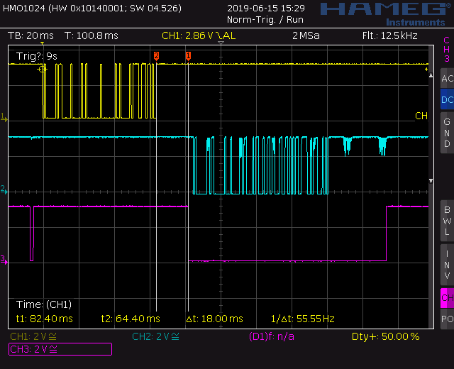

# modbusmaster

## Disable Bluetooth on RPi3

Add at the end of `/boot/config`:

    dtoverlay=pi3-disable-bt

Remove mentions of `serial0` from `/boot/cmdline`.

## Enable rs485 mode

<del>
Use the submodule rpirtscts to enable to alternate functions of the related
pins at the RPi MCU. It is submoduled here, can be found directly at https://github.com/mholling/rpirtscts

    cd rpirtscts
    gcc -o rpirtscts rpirtscts.c
    sudo ./rpirtscts on

This needs to be done at every boot.

Kudos to danjperron, cmp. https://www.raspberrypi.org/forums/viewtopic.php?f=98&t=224533&hilit=rs+485#p1383709

(Note, please: This software is under the GPL 3.0 license. However, I do not derive from this software, I use it in an unchanged way. It is not integrated into my sources, it just needs to be called once the RPi has booted.)
</del>

The approach to enable the transmitter has been changed due to timing issues with disabling the transmitter after the TX phase when talking to Modbus devices (see below), so this step is not longer required.

## Pinout

Find a good pinout diagram at https://raw.githubusercontent.com/ppelleti/hs-wiringPi/master/pin-diagram.png.

TX is at GPIO14, RX is at GPIO15 and RTS (control line for transmitter enable) is at GPIO17.

## Schematics

## Python snippet to test

### Pure RS485 test 

#### Test 1: Transmit only

(See also `./snippets/test1.py`.)

    import serial.rs485
    ser=serial.rs485.RS485(port='/dev/ttyAMA0',baudrate=2400)
    ser.rs485_mode = serial.rs485.RS485Settings(False,True)
    ser.write('a test'.encode('utf-8'))

Find an signal screenshot here:

Channel 1 in yellow has the TX line (GPIO14), channel 3 in purple has the RTS (GPIO17, transmitter enable line).

#### Test 2: Transmit and receive

(See also `./snippets/test2.py`.)

Here in contrast to the last script first an octet is received and then echoed.

    import serial.rs485
    ser=serial.rs485.RS485(port='/dev/ttyAMA0',baudrate=2400)
    ser.rs485_mode = serial.rs485.RS485Settings(False,True)
    ser.write('a test'.encode('utf-8'))

    while True:
        c = ser.read(1)
        ser.write(c)
        print(c, end='')

The signal graph is here:

Channel 1 in yellow has the TX line (GPIO14), channel 2 in blue has the RX line and channel 3 in purple has the RTS (GPIO17, transmitter enable line).

It is obvious that the DE (transmitter enable line, RTS controlled by `pyserial` in RS485 mode) is hold active a good while after all data already have been transmitted.

#### Test 3: First Modbus communication

(See also `./snippets/test3.py`.)

    from pymodbus.client.sync import ModbusSerialClient
    import serial.rs485

    ser=serial.rs485.RS485(port='/dev/ttyAMA0',baudrate=1200)
    ser.rs485_mode = serial.rs485.RS485Settings(rts_level_for_tx=False, 
                                                rts_level_for_rx=True,
                                                delay_before_tx=0.005,
                                                delay_before_rx=-0.0)

    client = ModbusSerialClient(method='rtu')
    client.socket = ser
    client.connect()
    result = client.read_holding_registers(address=0x2000, count=2, unit=1)
    print(result)
    print(result.registers)
    client.close()

Here, the port is initialized in RS485 mode and a device is queried.

Sometimes this works:

But sometimes is does not work:

The long hold time of about 18ms of the DE (transmitter enable, RTS line) becomes a problem, the response of the device already starts when the transmitter of the master is still enabled and thus the receiver of the master is still disabled.

A couple of experiments with deriving from the `RS485` class of `pyserial` and moving the time critical code (disabling the transmitter after the transmit) into C code failed. It wasn't faster at all. It became obvious that the system call `tcdrain`, which waits for all octets in the buffer to be transmitted returns very late.

Finally, the solution was to get away from the RS485 mode in `pyserial` and instead use the line status register of the UART via a system call to see whether the transmit register is empty and switch the DE line of the transmitter not longer with the RTS functionality but directly using `wiringPi`.

Derived class from `RS485` in `pyserial` (maybe this can be switched to the regular `Serial` class ...)

    class RS485Ext(serial.rs485.RS485):
        def __init__(self, *args, **kwargs):
            super(RS485Ext, self).__init__(*args, **kwargs)
            self.writec = ctypes.cdll.LoadLibrary('writec.so')
            r = self.writec.init()

        def write(self, b):
            d = serial.serialutil.to_bytes(b)
            r = self.writec.writec(self.fileno(), d, len(d))
            return r

C code of the function `writec` in the library `writec`:

    ssize_t writec(int fd, char *buf, size_t count) {
      digitalWrite(DE_PIN, HIGH);
      ssize_t r = write(fd, buf, count);
      uint8_t lsr;
      do {
        int r = ioctl(fd, TIOCSERGETLSR, &lsr);
      } while (!(lsr & TIOCSER_TEMT));
      digitalWrite(DE_PIN, LOW);

      return r;
    }

This change brought the break through:

The delta between TX end and DE disable is now only 2.2ms (instead of nearly 20ms before).

And finally Modbus communication works a lot more reliable:

However, still a lot of errors in the Modbus communication, certainly because of the dirty RX signal (blue). Furthermore it appears that the communication fails completely as soon as the termination resistor of 120 Ohms was placed.

A hint from the application AN-960 from Analog Devices (https://www.analog.com/media/en/technical-documentation/application-notes/AN-960.pdf) helped here. In chapter "Fail-Safe Biasing" it is explained that, when no transmitter is active at all the lines are completely floating and thus the RX signal behind the transceiver becomes dirty, as in the image above.

Pulling the A line to `Vcc` and the B line to `Gnd` using 1.5kOhm resistors, as proposed, solved this problem. And now also the termination resistor worked as expected.

